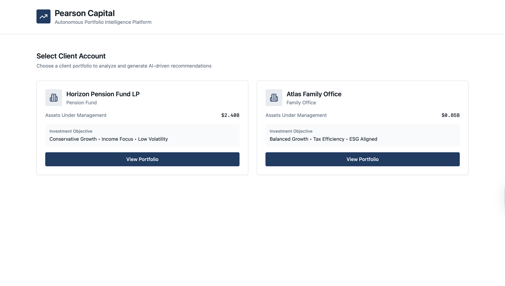
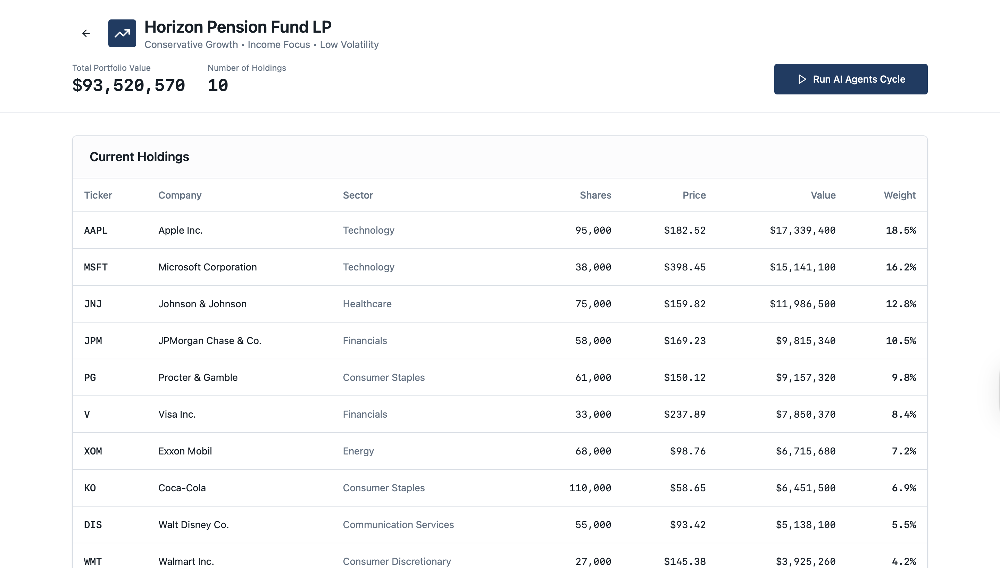
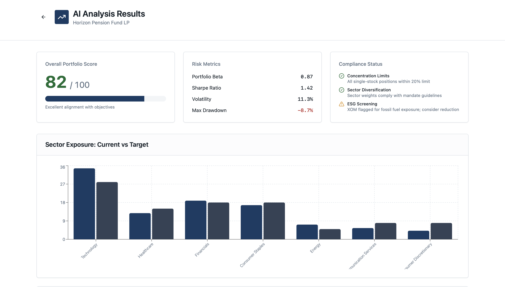
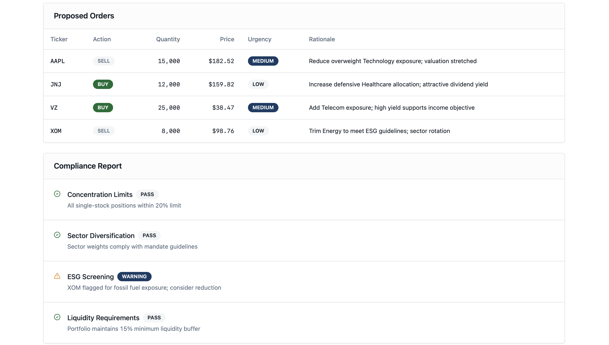

# Full-Stack AI Agents for Asset Management (Institutional Demo)

An end-to-end mock of an AI-driven asset manager. Reviewers can select a client, load holdings, run a multi-agent analysis (research, risk, portfolio construction, execution, compliance), and see proposed trades with mandate checks. Frontend is demo data; backend endpoints can be wired to live data later.

---

## Live Flow

1. **Select client account**
   <br>

2. **View current holdings for the client**
   <br>

3. **Run multi-agent analysis**
   <br>

4. **Results: score, risk, compliance, exposures**
   <br>

5. **Proposed orders + compliance report**
   <br>

---

## Repo layout
/backend
├─ main.py            # FastAPI app bootstrap
├─ api.py             # Endpoints: /clients, /portfolio/{id}, /agents/run, /orders/proposed
├─ demo/              # Seed data (clients, holdings, mandates, prices)
└─ requirements.txt   # FastAPI, pydantic, numpy/pandas (light), httpx

/ui
└─ (Lovable project)  # Uses backend endpoints or demo JSON for screenshots

/screenshots
├─ page1.png … page5.png
---

## Quickstart (backend)

```bash
python -m venv .venv && source .venv/bin/activate
pip install -r backend/requirements.txt
uvicorn backend.main:app --reload
# API will expose:
# GET /clients
# GET /portfolio/{client_id}
# POST /agents/run        # kicks off mock multi-agent cycle, returns analysis
# GET /orders/proposed?client_id=...
Notes
	•	The UI shown here runs on demo data for speed. The backend returns deterministic results suitable for review.
	•	To go beyond the demo, swap the backend/demo/* readers with live market/pricing feeds and your mandate store.
	•	Images are intentionally small (520px wide) to keep the README scannable.
